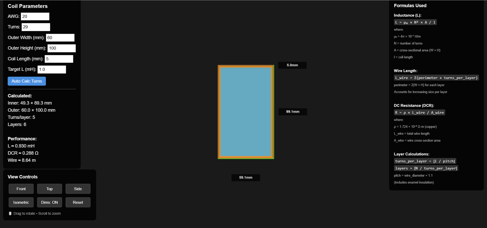

# 3D Coil Designer (HTML + Three.js)

[See it live](https://ratheesk.github.io/3d-coil-designer/).

This is a **web-based 3D coil visualizer** built with **pure HTML, CSS, and JavaScript** using [Three.js](https://threejs.org/).  
It allows you to design a rectangular air-core coil by adjusting parameters like **AWG, number of turns, coil dimensions, and target inductance**.

## ✨ Features

- Interactive 3D visualization of the coil (drag to rotate, scroll to zoom).
- Adjustable parameters:
  - **AWG (wire gauge)**
  - **Number of turns**
  - **Outer width / height**
  - **Coil length**
  - **Target inductance (auto-calculates turns)**
- Displays calculated results:
  - Inner dimensions
  - Turns per layer
  - Number of layers
  - Wire length
  - Estimated inductance (mH)
  - DC resistance (Ω)
- Shows coil **bobbin/former** in blue and copper windings in alternating shades.
- Toggle dimension lines (width, height, depth).
- View presets: **Front, Top, Side, Isometric**.

---

## 🚀 How to Run

1. Download the `coil.html` file from this repo.
2. Open it directly in your browser (Chrome, Firefox, Edge).
3. Use the left panel to adjust parameters.  
   Use the bottom control panel to change views or toggle dimensions.

---

## 🖱️ Controls

- **Rotate**: Click & drag the 3D view.
- **Zoom**: Scroll wheel.
- **Preset views**: Buttons in bottom-left panel.
- **Dims: ON/OFF**: Toggle dimension lines.
- **Reset**: Reset to default isometric camera view.

---

## 📐 Formulas Used

- **Inductance**:  
  `L = μ0 × N² × A / l`
- **Wire length**:  
  `Σ(perimeter × turns_per_layer)`
- **DC Resistance (DCR)**:  
  `R = ρ × L_wire / A_wire`

_(See right-hand panel in app for more details.)_

---

## 🛠️ Dependencies

- [Three.js](https://threejs.org/) (loaded via CDN)
- No build tools or frameworks required.

---

## 📜 License

Free to use and modify for educational or personal projects.
